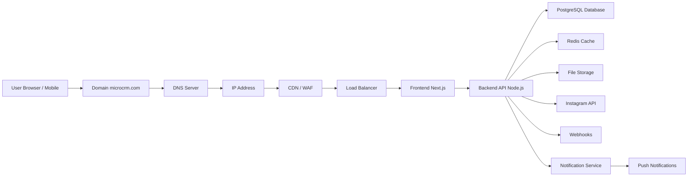

# System Architecture

```mermaid
flowchart LR

    A[User Browser / Mobile] --> B[Domain microcrm.com]
    B --> C[DNS Server]
    C --> D[IP Address]
    D --> E[CDN / WAF]
    E --> F[Load Balancer]

    F --> G[Frontend Next.js]
    G --> H[Backend API Node.js]

    H --> I[PostgreSQL Database]
    H --> J[Redis Cache]
    H --> K[File Storage]

    H --> L[Instagram API]
    H --> M[Webhooks]
    H --> N[Notification Service]

    N --> O[Push Notifications]

```
